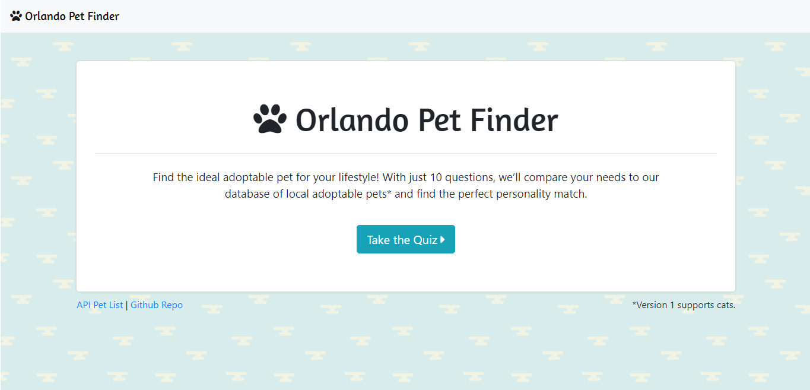
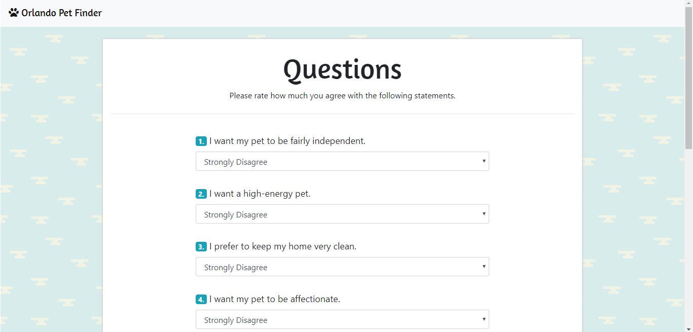
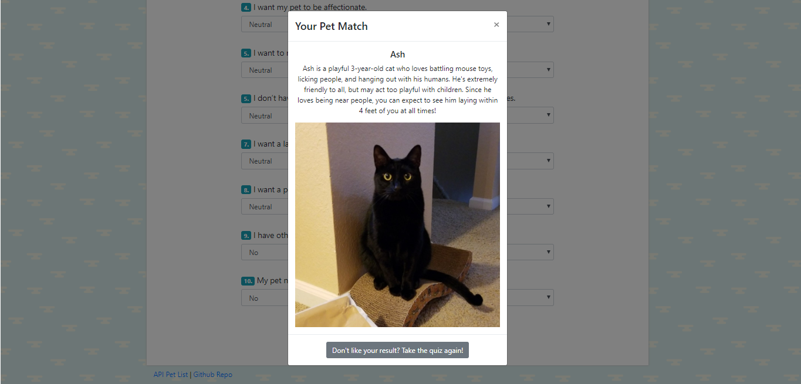

# Orlando Pet Finder

The Orlando Pet Finder web application is intended for use by local residents looking to adopt a pet from a nearby animal shelter. The user takes a 10-question quiz about the kind of pet they want, and the app matches them with an animal in the system that best matches their lifestyle.

Visit the website here: https://safe-chamber-17625.herokuapp.com/

## Technologies Used
* HTML/CSS
* Bootstrap
* Javascript
* JQuery
* Node.js
* Express.js
* Heroku for deployment

## Limitations and Future Development
* The app is currently limited to cats as pets. In the future, more animals will be added and supported in the quiz.

* The app is currently not using a database to store animal information. This functionality is important for shelters to be able to add, update, and remove the pets that are available for adoption. 

* The animals in the server do not have any links or information regarding adoption. In the future, users will be able to visit the webpage of the shelter that houses that animal and learn more about how to proceed with adoption.

* In the future, the app will be able to store the user's information and allow them to log in to view their saved matches. This will help them come to a decision regarding adoption.

* The code itself could benefit from reconfiguration with a template engine such as Handlebars.

* The quiz itself could benefit from rewrites.